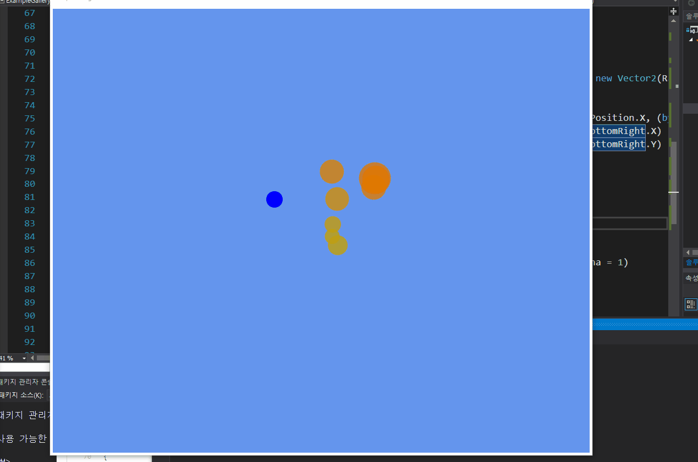

# UWP using win2d  

## output  

## benefit of using win2d

1. `better` performance than `xaml` based design. 
* Win2D is an easy-to-use Windows Runtime API for immediate mode 2D graphics rendering with GPU acceleration.

2. `easy` coding style. 
* You can use `mathematical` expression in `C#` easily.
* You can use `event` without any difficult.

3. Data Binding  
* You can use `data binding` easily. 

## references

You can get advanced information from `win2D` github run by `Microsoft`.   
[Win2D_github](https://github.com/Microsoft/Win2D)

